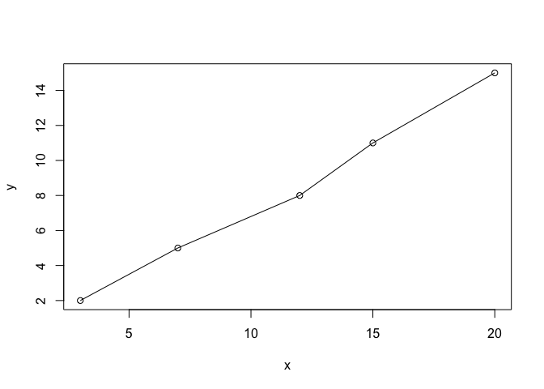
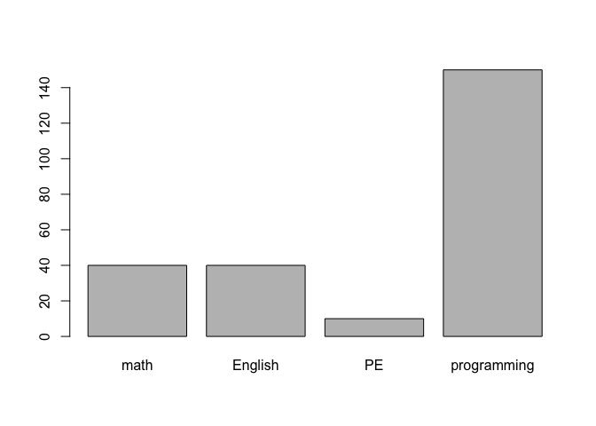

1.  Посчитать.

<!-- -->

    35 + 777

    ## [1] 812

    13 * 47

    ## [1] 611

    675 * 15

    ## [1] 10125

    849 * 629

    ## [1] 534021

1.  Число 11111111 умножено само на себя. . О чём говрит ошибка?

<!-- -->

    11111111^2;

    ## [1] 1.234568e+14

Далее число 11111111 умножено на 1111111?.

    #11111111*11111111?

Данное число не вычисляется, что указывает на ошибку в синтаксисе. 3.
Найдены площади прямоугольников с длинами (3, 7, 12, 15, 20) и ширинами
(2, 5, 8, 11, 15).

    x <-c(3, 7, 12, 15, 20)
    y <-c(2, 5, 8, 11, 15)
    x*y

    ## [1]   6  35  96 165 300

1.  Построен график этих длин и ширин.

<!-- -->

    plot(x,y)
    lines(x,y)

1.  Первокурсник Вася тратит очень мног овремени на домашнюю работу. 40
    минут на математику, 40 на английский, 10 на физкультуру и 150 минут
    на программирование.

<!-- -->

    tasks <-c("math" = 40, "English"= 40, "PE" = 10, "programming" = 150);
    barplot(tasks);

1.  Напитки разливаются вручную в банки по 455 мл, количество налитого
    нормально распределено со средним значением 450 мл. и стандартным
    отклонением 4 мл. Смоделировано разливание в 10000 бутылок и
    расчитана вероятность перелива банки.

<!-- -->

    drinks <-rnorm(10000, mean = 450, sd = 4)
    mean(drinks > 455)

    ## [1] 0.1106
